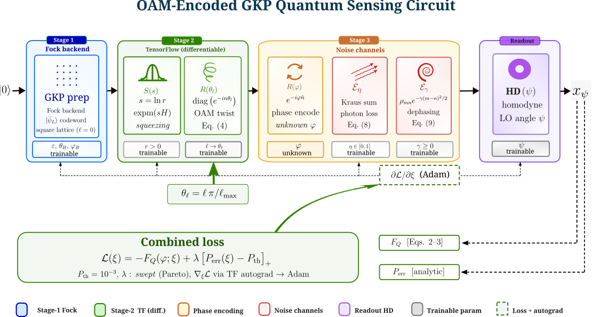

# OAM-Induced Lattice Rotation Reveals a Fractional Optimum in Fault-Tolerant GKP Quantum Sensing

[](https://arxiv.org/abs/2605.13271)
[](https://doi.org/10.5281/zenodo.20099263)
[](LICENSE)
[](https://www.python.org/)
[](https://strawberryfields.ai/)

**Corresponding Authors:**

- **Simanshu Kumar**<sup>1,2,†</sup>  \&  **Nandan S Bisht**<sup>1,\*</sup>  
   <sup>1</sup>  Department of Physics, D.S.B. Campus, Kumaun University, Nainital, Uttarakhand, India–263001

  <sup>2</sup>  Applied Optics & Spectroscopy Laboratory, Department of Physics,  
  Soban Singh Jeena University Campus, Almora, Uttarakhand, India–263601

<sup>†</sup> [simanshu@kunainital.ac.in](mailto:simanshu@kunainital.ac.in) &nbsp; <sup>*</sup>[bisht.nandan@kunainital.ac.in](mailto:bisht.nandan@kunainital.ac.in)

---

## Overview

This repository contains the complete simulation code and figure-generation scripts for the paper:

> **OAM-Induced Lattice Rotation Reveals a Fractional Optimum in Fault-Tolerant GKP Quantum Sensing**  
> Simanshu Kumar and Nandan S Bisht (2026)  
> [arXiv:2605.13271](https://arxiv.org/abs/2605.13271) \[quant-ph\]

### Key Result

OAM encoding and GKP lattice geometry are structurally coupled: a fractional OAM charge $\ell = 1.5$ — implemented via a fractional Fourier transform of order $\alpha = 0.75$ — achieves a **23.9× reduction** in logical error rate $P_{\rm err}$ over the square-lattice baseline, while leaving the quantum Fisher information $\mathcal{F}_Q$ unchanged to within $0.2\%$.

---

## Summary

GKP (Gottesman–Kitaev–Preskill) codes protect quantum information by encoding a logical qubit into the position-momentum phase space of a harmonic oscillator using a periodic stabilizer lattice. The lattice geometry — its orientation angle $\theta$ and aspect ratio $r$ — directly determines how well the code corrects errors from photon loss $\eta$ and dephasing $\gamma$.

This work establishes that orbital angular momentum (OAM) modes provide a natural geometric handle for rotating the GKP stabilizer lattice: a mode of topological charge $\ell$ (implemented physically as a fractional Fourier transform of order $\alpha = 2\ell/\ell_{\max}$) induces a continuous phase-space rotation

$$\theta_\ell = \frac{\ell\,\pi}{\ell_{\max}}.$$

Using an end-to-end differentiable simulation built on Strawberry Fields and TensorFlow, we jointly optimize the lattice angle $\theta_\ell$, aspect ratio $r$, finite-energy envelope $\epsilon$, and adaptive homodyne angle $\psi$ to simultaneously maximize $\mathcal{F}_Q$ and minimize $P_{\rm err}$ subject to $P_{\rm err} \leq 10^{-3}$.

The central finding is that the globally optimal rotation is achieved at the **fractional** OAM charge $\ell = 1.5$ ($\theta = 67.5^\circ$) — surpassing all integer values including $\ell = 2$ ($15.7\times$) by a factor of **23.9×** over the square-lattice baseline. This fractional optimum arises from an exact $180^\circ$ periodicity in the $P_{\rm err}(\theta)$ landscape, confirmed analytically via the transcendental balance equation

$$\mathcal{B}(\theta;\eta,\gamma,r) \;\equiv\; r^2\,\frac{\phi(u_q)}{\sigma_q^3} - \frac{\phi(u_p)}{\sigma_p^3} = 0,$$

whose solution $\theta^*(\eta, \gamma, r)$ is proven to decrease monotonically with both $\gamma$ and $\eta$. The optimum is experimentally accessible via a cylindrical-lens fractional Fourier transformer ($\alpha = 0.75$) or a spatial light modulator — linear optics requiring no additional squeezing or non-Gaussian resources.

---

## Circuit Architecture



**Trainable parameters:** $r$ (aspect ratio), $\epsilon$ (envelope), $\ell$ (OAM charge $\to$ $\theta_\ell = \ell\pi/\ell_{\max}$), $\psi$ (homodyne angle)  
**Fixed parameters:** $\varphi_{\rm est}$ (scanned to produce error landscape) · $\eta$, $\gamma$ (noise points)  
**Output:** logical error rate $P_{\rm err}$ and quantum Fisher information $\mathcal{F}_Q$  
**Optimiser:** Adam · 500 steps · cosine LR annealing (${\rm lr}_0 = 5\times10^{-3}$) · gradient clip 1.0

---

## Key Results

| Geometry | $\ell$ | $\theta$ | $P_{\rm err}$ ($\eta{=}0.9$, $\gamma{=}0.05$) | Improvement | $\mathcal{C}$ |
|---|---|---|---|---|---|
| Square | $0$ | $0^\circ$ | $4.13 \times 10^{-4}$ | $1.0\times$ | $76.1$ |
| OAM $\ell=1$ | $1$ | $45^\circ$ | $5.42 \times 10^{-5}$ | $7.6\times$ | $96.0$ |
| **OAM $\ell=1.5$ ★** | $\mathbf{1.5}$ | $\mathbf{67.5^\circ}$ | $\mathbf{1.73 \times 10^{-5}}$ | $\mathbf{23.9\times}$ | $\mathbf{107.1}$ |
| OAM $\ell=2$ | $2$ | $90^\circ$ | $2.63 \times 10^{-5}$ | $15.7\times$ | $103.0$ |

- $\mathcal{F}_Q = 9.764$ — geometry-invariant ($< 0.2\%$ variation across all geometries)
- Optimal angle $\theta^* = 64.4^\circ$ from the transcendental balance equation
- Metrological capacity **+41% gain** at $\ell=1.5$:

$$\mathcal{C} = \mathcal{F}_{Q} \cdot (-\ln P_{\mathrm{err}}) = 107.1$$

---

## Repository Structure

```
oam-gkp-quantum-metrology/
│
├── oam_gkp/                        # Core simulation package
│   ├── __init__.py
│   ├── circuit.py                  # GKP circuit with OAM twist + noise channels
│   ├── lattice.py                  # GKP lattice geometry and symplectic structure
│   ├── loss.py                     # Combined loss: F_Q + λ[P_err − P_th]+
│   ├── noise.py                    # Loss (ℰ_η) and dephasing (ℰ_γ) channels
│   ├── optimizer.py                # Adam optimizer with cosine LR annealing
│   ├── qfi.py                      # Quantum Fisher information: F_Q = 4·Var(n̂)
│   ├── run_fractional_ell.py       # Fractional ℓ sweep (ℓ = 0 to ℓ_max)
│   ├── states.py                   # GKP state preparation and caching
│   └── utils.py                    # Shared utilities and helper functions
│
├── circuit_diagram.png             # Fig. 1 — circuit schematic (Inkscape)
│
├── results/
│   ├── calculations/               # CSV outputs from calculations.py
│   ├── fractional_ell_results.csv  # Full ℓ sweep data
│   ├── hexagonal_results.json      # Hexagonal lattice comparison data
│   └── figures/                    # All generated figures (PDF/PNG)
│       ├── training_eta0.90_gamma0.050_ell0.0.pdf  # Appendix Fig. A1
│       ├── training_eta0.90_gamma0.050_ell1.0.pdf  # Appendix Fig. A2
│       ├── training_eta0.90_gamma0.050_ell1.5.pdf  # Appendix Fig. A3
│       ├── training_eta0.90_gamma0.050_ell2.0.pdf  # Appendix Fig. A4
│       ├── training_eta0.80_gamma0.100_ell0.0.pdf  # Appendix Fig. A5
│       ├── training_eta0.80_gamma0.100_ell1.0.pdf  # Appendix Fig. A6
│       ├── training_eta0.80_gamma0.100_ell1.5.pdf  # Appendix Fig. A7
│       ├── training_eta0.80_gamma0.100_ell2.0.pdf  # Appendix Fig. A8
│       ├── wigner_eta0.90_gamma0.050_ell0.0.pdf    # Wigner — square, low noise
│       ├── wigner_eta0.90_gamma0.050_ell1.0.pdf    # Wigner — ℓ=1, low noise
│       ├── wigner_eta0.90_gamma0.050_ell1.5.pdf    # Wigner — ℓ=1.5 ★, low noise
│       ├── wigner_eta0.90_gamma0.050_ell2.0.pdf    # Wigner — ℓ=2, low noise
│       ├── wigner_eta0.80_gamma0.100_ell0.0.pdf    # Wigner — square, high noise
│       ├── wigner_eta0.80_gamma0.100_ell1.0.pdf    # Wigner — ℓ=1, high noise
│       ├── wigner_eta0.80_gamma0.100_ell1.5.pdf    # Wigner — ℓ=1.5 ★, high noise
│       └── wigner_eta0.80_gamma0.100_ell2.0.pdf    # Wigner — ℓ=2, high noise
│
├── main.py                         # Main entry point — training + results
├── optimizer.py                    # Top-level optimizer entry point
├── figures_nature.py               # Generate Figs. 1–8 (main paper)
├── figures_analysis.py             # Generate Figs. 9–10
├── calculations.py                 # Reproduce all tables and analytical results
├── derivations.py                  # Symbolic + numerical derivation verification
├── patch_perr.py                   # P_err post-processing and correction utilities
├── run_fractional_ell.py           # Run fractional OAM sweep (top-level)
├── run_hexagonal.py                # Hexagonal lattice comparison runs
│
├── requirements.txt                # pip dependencies
├── environment.yml                 # Conda environment (optional)
├── README.md
└── LICENSE
```

---

## Installation

### Requirements

| Package | Version |
|---|---|
| Python | 3.10.19 |
| Strawberry Fields | 0.23.0 |
| TensorFlow | 2.20.0 |
| NumPy | 2.2.6 |
| SciPy | 1.13.1 |
| Matplotlib | 3.10.8 |
| SymPy | 1.14.0 |

### Option 1 — pip (fastest)

```bash
conda create -n noon-sim python=3.10
conda activate noon-sim
pip install -r requirements.txt
```

### Option 2 — conda (fully reproducible)

```bash
conda env create -f environment.yml
conda activate noon-sim
```

### Verify installation

```bash
python -c "import strawberryfields; import tensorflow; print('OK')"
```

**Hardware used:** Intel Core i5 13th-gen, NVIDIA GeForce RTX 3050 (6 GB VRAM), 16 GB RAM, Arch Linux.

---

## Reproducing Results

### Full simulation

```bash
git clone https://github.com/simanshukumar369/oam-gkp-quantum-metrology.git
cd oam-gkp-quantum-metrology
python main.py --mode single
```

Runs 500-step Adam optimisation for each $(\eta, \gamma, \ell)$ combination (~125–130 s per run on RTX 3050).

### Individual modes

```bash
python main.py --mode single --eta 0.9 --gamma 0.05 --ell 1.5   # single geometry
python main.py --mode pareto                                       # Pareto frontier
python main.py --mode diagram                                      # phase diagram
python main.py --mode verify                                       # verify balance equation
```

### Key $\ell=1.5$ runs (global optimum)

```bash
python main.py --mode single --eta 0.9 --gamma 0.05 --ell 1.5   # fractional optimum, low noise
python main.py --mode single --eta 0.8 --gamma 0.10 --ell 1.5   # fractional optimum, high noise
```

### Tables and derivations

```bash
python calculations.py   # all 9 tables → results/calculations/
python derivations.py    # D1–D12 derivation verification
```

### Figures

All figures are generated programmatically except Fig. 1 (circuit diagram, provided as `circuit_diagram.png`).

```bash
# Fig. 2 — Noise landscape: P_err(θ) at low and high noise
python figures_nature.py --fig noise_landscape

# Fig. 3 — Lattice geometry comparison
python figures_nature.py --fig geometry_comparison

# Fig. 4 — Wigner functions W(q,p) — run training first
python main.py --mode single
python figures_nature.py --fig wigner

# Fig. 5 — P_err improvement summary
python figures_nature.py --fig improvement_summary

# Fig. 6 — Fractional ℓ curve
python figures_nature.py --fig fractional_ell

# Fig. 7 — P_err(θ) curve with analytic optimum θ*
python figures_analysis.py --fig perr_theta_curve

# Fig. 8 — Phase diagram
python figures_nature.py --fig phase_diagram

# Fig. 9 — θ*(η, γ) phase diagram
python figures_analysis.py --fig theta_phase_diagram

# Fig. 10 — Convergence histories
python figures_nature.py --fig convergence

# Appendix Figs. A1–A8 — training convergence per run
python main.py --mode single --eta 0.9 --gamma 0.05 --ell 0.0
python main.py --mode single --eta 0.9 --gamma 0.05 --ell 1.0
python main.py --mode single --eta 0.9 --gamma 0.05 --ell 1.5
python main.py --mode single --eta 0.9 --gamma 0.05 --ell 2.0
python main.py --mode single --eta 0.8 --gamma 0.10 --ell 0.0
python main.py --mode single --eta 0.8 --gamma 0.10 --ell 1.0
python main.py --mode single --eta 0.8 --gamma 0.10 --ell 1.5
python main.py --mode single --eta 0.8 --gamma 0.10 --ell 2.0

# Generate ALL figures at once
python figures_nature.py && python figures_analysis.py
```

---

## Citation

```bibtex
@article{Kumar2026oam,
  title         = {{OAM}-Induced Lattice Rotation Reveals a Fractional Optimum
                   in Fault-Tolerant {GKP} Quantum Sensing},
  author        = {Kumar, Simanshu and Bisht, Nandan S.},
  year          = {2026},
  eprint        = {2605.13271},
  archivePrefix = {arXiv},
  primaryClass  = {quant-ph}
}
```

Companion paper:

```bibtex
@article{Kumar2026noon,
  title         = {Quantum-Enhanced Single-Parameter Phase Estimation
                   with Adaptive {NOON} States},
  author        = {Kumar, Simanshu and Bisht, Nandan S.},
  year          = {2026},
  eprint        = {2604.12323},
  archivePrefix = {arXiv},
  primaryClass  = {quant-ph}
}
```

---

## Data Availability

Numerical data and trained model parameters are archived on Zenodo.  
**Zenodo DOI:** [`10.5281/zenodo.20099263`](https://doi.org/10.5281/zenodo.20099263)

---

## License

MIT License — see [LICENSE](LICENSE) for details.

---

## Acknowledgements

Simulations use [Strawberry Fields](https://strawberryfields.ai) by Xanadu Quantum Technologies and [TensorFlow](https://tensorflow.org).
